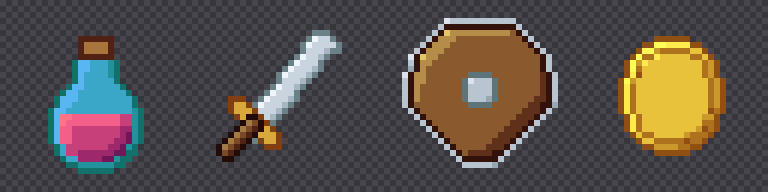
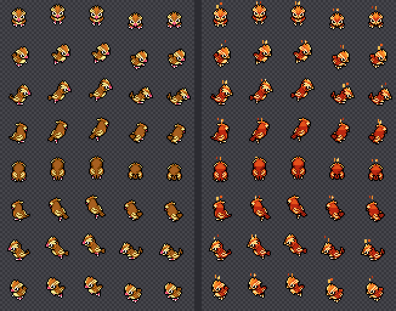
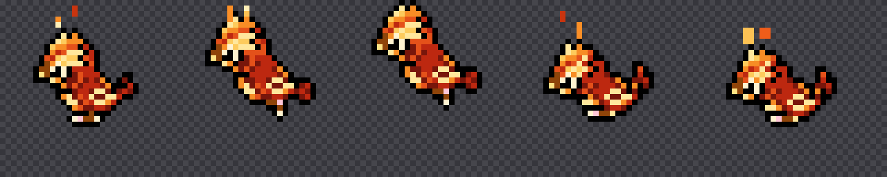
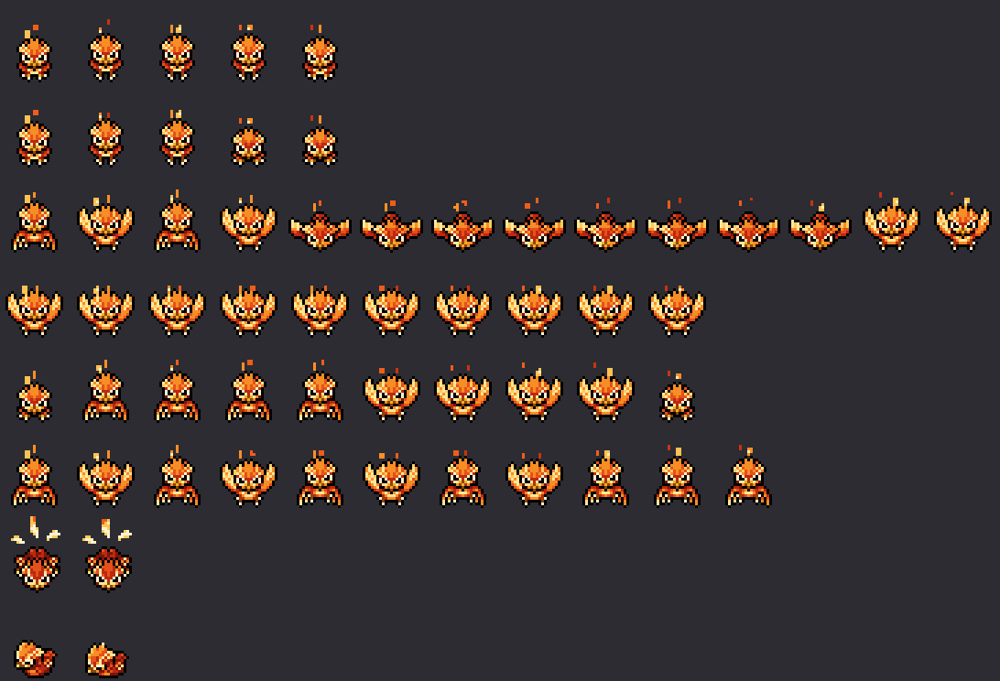

# K4 Pinza

A pixel art editor that knows **what** you are drawing, not just that you are
drawing pixels.

*(En español: [README.es.md](README.es.md) — the code, the comments and the
interface are in Spanish.)*

Drawing the sprite is the easy part. What wears you down is everything around
it: that this object is 32×32 except when it stands up and then it is 48 tall;
that if it is rectangular it needs four files with the right suffix and that
turning it also turns its footprint; that a character sheet is columns × 8 rows
in an order of facings you cannot get wrong, with one duration per frame
measured in ticks.

That normally lives in your head and in a manifest you hand-edit after
exporting. Here you declare it **once** — in a JSON file called a pack — and
everything else follows: canvas size, how many frames, how many facings, what
the file is called and where it is copied on export.

The stock pack imposes nothing, so this works just as well for drawing a single
icon.

## Install

    git clone https://github.com/k4ditano/k4-pinza
    cd k4-pinza
    ./instalar.sh

It puts the program in your applications menu with its icon, a `pinza` command
in the terminal, and offers itself in the "open with" menu of any PNG so you can
bring it in as a layer. **It copies nothing and asks for no `sudo`**: it
installs symlinks inside your home directory, so updating is a `git pull`.

    ./instalar.sh --quitar      undo it

Uninstalling does not touch your drawings, your packs or your scripts.

You need [Quickshell](https://quickshell.org/), Qt 6 (`qt6-base`,
`qt6-declarative`), Python 3 with Pillow, and the `Adwaita Sans` and
`MesloLGS Nerd Font Mono` fonts. The installer checks and tells you before
touching anything.

## Getting started

    pinza                    open the editor
    pinza Bicho.pinza        open that project
    pinza dibujo.png         import it as a layer

A loose PNG also opens for editing: saving puts it back in its own file and
"save as" asks for a name and a place like any image editor, rather than routing
you through a project you did not want. The format follows the extension you
type. And if the drawing is going to
be a character, `Ctrl+K` → "acciones" turns it into one: you add actions with
whatever names you like, choose how many facings each has, and the missing
facings copy from one you have already drawn. No pack needed for any of it.

`Ctrl+K` opens the command palette and **everything** is in there, searchable by
loose fragments: "fl h" finds "Flip horizontally". No menus to walk through.

## What makes it different

**Three axes, not two.** A cel is layer × frame × **facing**. In other editors
an eight-facing sheet is assembled by hand; here the facing is a first-class
axis, with a compass that lays them out geographically and mirror linking: you
draw east and west comes out flipped. For an icon it is simply one and the
compass never appears.

**Each frame is as wide as it is long.** The strip at the bottom is not equal
boxes: each frame is as wide as the ticks it takes, with its own ruler. Dragging
its right edge retimes that one; typing the total on the right retimes the whole
animation, stretching or shrinking every frame in proportion — the balance you
had already tuned is kept, only the tempo changes. And separately, a ×1 next to
play to watch it in slow motion without touching what gets exported.

**The swatch, at real size.** While drawing you are always at ×8 or ×16, and at
that magnification anything looks fine: outlines read, shadows separate. At real
size half of that disappears, and without seeing it while you draw you find out
on export. It floats over the canvas, drags to wherever it is least in the way,
and animates along with the strip.

| | |
|---|---|
|  |  |
| **In-game preview.** The sprite on a floor, with its shadow, and the measurements a game reads out of the pixels: where the feet land, how much the silhouette takes up. Fourteen empty rows under the figure are fourteen pixels of air where it should be standing, and on the canvas that does not show. | **Ramps, not a grid.** The working unit is shadow → body → highlight, which is how you think while drawing. The shading ink moves each pixel one step along *its* ramp instead of flattening it with a solid colour. The wheel lives inside the panel: picking a colour should not cover your drawing. |

**Change one colour across the whole character.** Replace colour asks how far it
reaches: this cel, every frame of this facing, all eight, or — for a character
with several actions — **the whole creature**, including the actions you do not
have in front of you. Doing it by hand across an eleven-frame, eight-row sheet
is eighty-eight clicks, and that is one action; missing one is enough for it to
change colour when it starts walking.

**Real tile mode and a test map.** The canvas wraps: you draw across the seam
and the stroke comes out the other side. And a tileset is not judged by looking
at the sheet but by seeing it spread across a field — which is where the seams
show and where you notice that the flower that looked pretty, every three tiles,
turns the meadow into a carpet.

**Rotate and scale by eye** (`Ctrl+T`), with the result visible as you drag.
Every change is redone from the starting state, never on top of the previous
one: rotating five degrees five times is not rotating twenty-five, it is
destroying the drawing by resampling what was already resampled. And trying
twenty angles leaves **one** history entry.

**Whole characters.** If the pack declares it, a character is not one sheet but
one per action — idle, walk, attack… — and the editor treats them as a single
project: you jump between them with one click, each with its geometry already
set, and exporting writes the sheets, the animation file that ties them together
and the record that registers it, all three in agreement.

**Scripts in JavaScript**, in `~/.config/pinza/guiones/*.js`. They receive the
open document and everything they do enters the history as **one** step, so they
can be tried without fear.

And the usual, with no surprises: every kind of selection with add, subtract and
intersect; pencil with pixel-perfect strokes, eraser, bucket, eyedropper,
shapes, dithered gradient, blur, smudge, dodge, burn; custom brushes; eighteen
blend modes, groups, alpha lock, reference layers; onion skin, tags, linked
cels; symmetry and grids; `.gpl`, `.hex` and from-PNG palettes; GIF and APNG.

**No colour limits.** A pack may bring a style guide, but it is an odometer and
not a barrier: it tells you where you are and it can be switched off.

## Let the AI draw

There is an **MCP** server in `mcp/pinza-mcp.py`: hook it up to Claude Code —or
any MCP client— and you can ask it to make you things.

    claude mcp add pinza -- ~/.local/bin/pinza --mcp

It drives **the window you already have open**, so you watch it draw live, and
everything it does enters the history as **one** step: a single Ctrl+Z undoes
the whole intervention. It can create documents, draw, run any editor command,
measure the silhouette, save and export according to the contract — and above
all it can **look**: `pinza_ver` hands it back an image of how it is going,
which is what turns this into a draw-and-correct loop instead of a shot in the
dark.

What it does not do is place pixels by hand, because it is bad at it: writing a
grid symbol by symbol it loses track between rows and cannot proofread itself.
It draws with `core/figura.js`, which is the other half of this and works just
as well for a script of your own — you declare **masses** (ellipses, capsules,
polygons), union them into a silhouette, and the shading comes out of **a
rule**: a light direction and a ramp.

    const cuerpo = F.une(F.disco(W,H,16,21,8), F.capsula(W,H,16,10,16,15,3.5))
    F.cuerpo(b, cuerpo, { rampa: pinza.rampa("fríos"), luz: "NO", amplitud: 2 })

It is the same trick the program's own icon is drawn with. And because shading
moves each pixel **along its ramp** instead of smearing grey on top, what comes
out keeps the game's colours and can be recoloured afterwards like any other
drawing.

That said: this does not give it taste. It gives it consistency and precision —
the eighth facing, the in-betweens, the outline, a conforming palette, the
seams of a tileset, the forty-seven pieces of an autotile. The proportions and
the creature's character are still yours.

**And it can start from something that already exists.** `pinza_referencia`
brings an image in as a tracing layer —from your disk, from a URL, or
`pokeapi:pidgey` to fetch a sprite— and `pinza_analiza` pulls its numbers:
proportions, width profile, and the colours already grouped into **ramps**,
which is what makes a palette substitutable. `pinza_compara` tells you in a
single number how close yours is to the reference, and which band disagrees
most.

The tracing layer **is never exported**, and that is not a promise: the
compositor that writes the PNGs does not even look at it.

It is for the part that costs the most: a variant, a redesign, "the same but in
metal". Proportions are the one thing you cannot deduce from a description, and
they are exactly what a reference hands you measured.

And over the **whole creature**, not one of its sheets: `pinza_referencia` and
the pack's catalogue bring in all eight actions —each with its own geometry—
and the same script walks every one. A recolour that only reaches `Walk` leaves
a creature that changes colour when it stops, and that does not show up while
drawing: it shows up while playing.

With the ramps pulled out, a **variant stops being drawn**: each colour is
placed in its ramp, you look at which step it lands on, and it is replaced by
whatever occupies that same step in the target ramp. Shadow stays shadow, so
the creature still reads as itself. The forty cels above —eight facings by five
frames— are one call, and the silhouette did not move by a single pixel.

The outline is detected and **left alone**. Not by its colour, which can be
anything, but by where it is: the pixels with a transparent neighbour. A pack
usually has an outline convention —crabh's is pure black across every creature—
and a single sprite breaking it stands out from across the room.

And there is a net underneath. `pinza_verifica` reads the PNGs already
written —not what is on screen— and flags colours outside the palette, outlines
tinted by accident, or drawings clipped against the edge of the canvas; given
the original as a baseline, it only blames you for what you added.
`pinza_convenciones` looks at the art that already exists and tells you which
rules it actually follows, which are not always the written ones.

The server hands the model a **working order** on connect —measure before you
touch, leave the outline alone, verify on disk— and ships the tools to follow
it: `pinza_convenciones` asks the existing art what the house rules actually
are, and `pinza_verifica` reads the written PNGs and says what went wrong,
comparing against the original so it does not blame you for what the source
material already had.

## The format

A folder with one JSON and one PNG per cel:

    Bicho.pinza/
      proyecto.json          layers, frames, durations, links
      celdas/c1.0.3.png      layer . frame . facing
      paleta.gpl

No custom binary, and you notice daily: it shows up in a `git diff`, you can
open a single frame in any other editor, and if tomorrow the program does not
start the art is still there.

## Packs

A pack is a JSON file: it declares its palettes, its contracts — canvas, axes,
naming pattern, output folder — and, if it wants, a manifest to patch and a
style guide. The built-in ones live in `packs/`; yours go in
`~/.config/pinza/packs/*.json` and win if they repeat an `id`, which is how you
tweak a stock one without touching the repository.

## Under the hood

It is written in QML on [Quickshell](https://quickshell.org/), with the pixel
engine in plain JavaScript. If you are going to touch it,
[docs/interior.md](docs/interior.md) (in Spanish) explains how it is laid out,
why, and the six things this Qt gets wrong that you need to know before going
anywhere near the canvas.

    ./pruebas/correr            the tests, without opening a window

## Licence

[GPL-3.0](LICENSE). Use it, change it, sell it if you like; the only thing asked
is that if you distribute a modified version you also distribute its source
under the same licence. It is what GIMP, Krita and LibreSprite use, and it means
this cannot be closed: any improvement you make and publish stays available to
whoever comes next.
