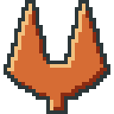
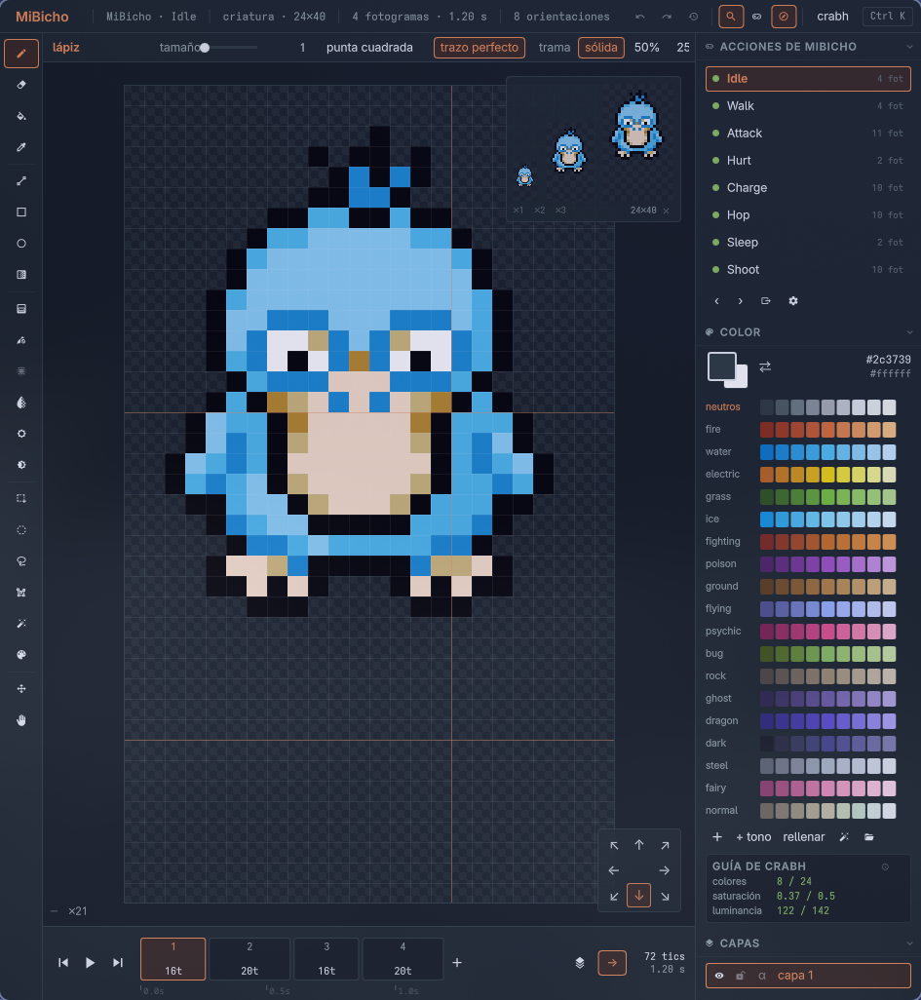
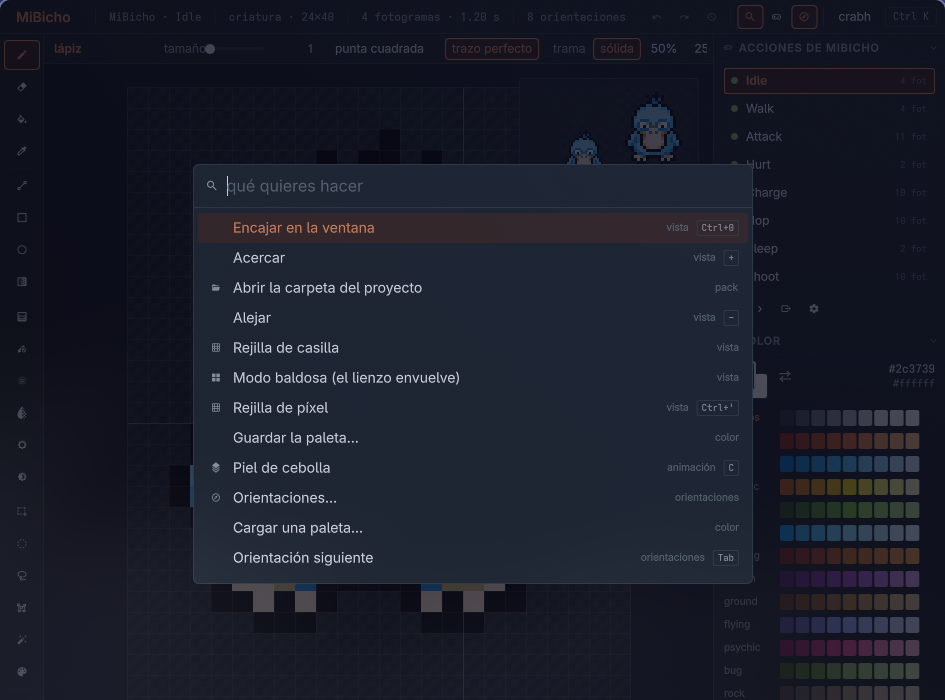
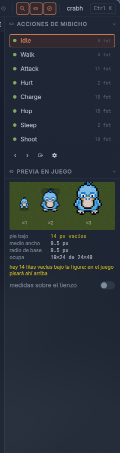
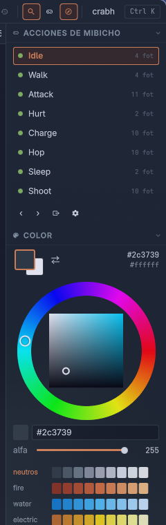

# K4 Pinza

A pixel art editor that knows **what** you are drawing, not just that you are
drawing pixels.

*(En español: [README.es.md](README.es.md) — the code, the comments and the
interface are in Spanish.)*

Drawing the sprite is the easy part. What wears you down is everything around
it: that this object is 32×32 except when it stands up and then it is 48 tall;
that if it is rectangular it needs four files with the right suffix and that
turning it also turns its footprint; that a character sheet is columns × 8 rows
in an order of facings you cannot get wrong, with one duration per frame
measured in ticks.

That normally lives in your head and in a manifest you hand-edit after
exporting. Here you declare it **once** — in a JSON file called a pack — and
everything else follows: canvas size, how many frames, how many facings, what
the file is called and where it is copied on export.

The stock pack imposes nothing, so this works just as well for drawing a single
icon.

## Install

    git clone https://github.com/k4ditano/k4-pinza
    cd k4-pinza
    ./instalar.sh

It puts the program in your applications menu with its icon, a `pinza` command
in the terminal, and offers itself in the "open with" menu of any PNG so you can
bring it in as a layer. **It copies nothing and asks for no `sudo`**: it
installs symlinks inside your home directory, so updating is a `git pull`.

    ./instalar.sh --quitar      undo it

Uninstalling does not touch your drawings, your packs or your scripts.

You need [Quickshell](https://quickshell.org/), Qt 6 (`qt6-base`,
`qt6-declarative`), Python 3 with Pillow, and the `Adwaita Sans` and
`MesloLGS Nerd Font Mono` fonts. The installer checks and tells you before
touching anything.

## Getting started

    pinza                    open the editor
    pinza Bicho.pinza        open that project
    pinza dibujo.png         import it as a layer

`Ctrl+K` opens the command palette and **everything** is in there, searchable by
loose fragments: "fl h" finds "Flip horizontally". No menus to walk through.

## What makes it different

**Three axes, not two.** A cel is layer × frame × **facing**. In other editors
an eight-facing sheet is assembled by hand; here the facing is a first-class
axis, with a compass that lays them out geographically and mirror linking: you
draw east and west comes out flipped. For an icon it is simply one and the
compass never appears.

**Each frame is as wide as it is long.** The strip at the bottom is not equal
boxes: each frame is as wide as the ticks it takes, with its own ruler. Dragging
its right edge retimes the animation while you watch it, which is how you decide
whether a hit feels right.

**The swatch, at real size.** While drawing you are always at ×8 or ×16, and at
that magnification anything looks fine: outlines read, shadows separate. At real
size half of that disappears, and without seeing it while you draw you find out
on export. It floats over the canvas, drags to wherever it is least in the way,
and animates along with the strip.

| | |
|---|---|
|  |  |
| **In-game preview.** The sprite on a floor, with its shadow, and the measurements a game reads out of the pixels: where the feet land, how much the silhouette takes up. Fourteen empty rows under the figure are fourteen pixels of air where it should be standing, and on the canvas that does not show. | **Ramps, not a grid.** The working unit is shadow → body → highlight, which is how you think while drawing. The shading ink moves each pixel one step along *its* ramp instead of flattening it with a solid colour. The wheel lives inside the panel: picking a colour should not cover your drawing. |

**Change one colour across the whole character.** Replace colour asks how far it
reaches: this cel, every frame of this facing, or all eight. Doing it by hand
across an eleven-frame, eight-row sheet is eighty-eight clicks, and missing one
is enough to make the animation flicker. The whole change is **one** history
step.

**Real tile mode and a test map.** The canvas wraps: you draw across the seam
and the stroke comes out the other side. And a tileset is not judged by looking
at the sheet but by seeing it spread across a field — which is where the seams
show and where you notice that the flower that looked pretty, every three tiles,
turns the meadow into a carpet.

**Rotate and scale by eye** (`Ctrl+T`), with the result visible as you drag.
Every change is redone from the starting state, never on top of the previous
one: rotating five degrees five times is not rotating twenty-five, it is
destroying the drawing by resampling what was already resampled. And trying
twenty angles leaves **one** history entry.

**Whole characters.** If the pack declares it, a character is not one sheet but
one per action — idle, walk, attack… — and the editor treats them as a single
project: you jump between them with one click, each with its geometry already
set, and exporting writes the sheets, the animation file that ties them together
and the record that registers it, all three in agreement.

**Scripts in JavaScript**, in `~/.config/pinza/guiones/*.js`. They receive the
open document and everything they do enters the history as **one** step, so they
can be tried without fear.

And the usual, with no surprises: every kind of selection with add, subtract and
intersect; pencil with pixel-perfect strokes, eraser, bucket, eyedropper,
shapes, dithered gradient, blur, smudge, dodge, burn; custom brushes; eighteen
blend modes, groups, alpha lock, reference layers; onion skin, tags, linked
cels; symmetry and grids; `.gpl`, `.hex` and from-PNG palettes; GIF and APNG.

**No colour limits.** A pack may bring a style guide, but it is an odometer and
not a barrier: it tells you where you are and it can be switched off.

## The format

A folder with one JSON and one PNG per cel:

    Bicho.pinza/
      proyecto.json          layers, frames, durations, links
      celdas/c1.0.3.png      layer . frame . facing
      paleta.gpl

No custom binary, and you notice daily: it shows up in a `git diff`, you can
open a single frame in any other editor, and if tomorrow the program does not
start the art is still there.

## Packs

A pack is a JSON file: it declares its palettes, its contracts — canvas, axes,
naming pattern, output folder — and, if it wants, a manifest to patch and a
style guide. The built-in ones live in `packs/`; yours go in
`~/.config/pinza/packs/*.json` and win if they repeat an `id`, which is how you
tweak a stock one without touching the repository.

## Under the hood

It is written in QML on [Quickshell](https://quickshell.org/), with the pixel
engine in plain JavaScript. If you are going to touch it,
[docs/interior.md](docs/interior.md) (in Spanish) explains how it is laid out,
why, and the six things this Qt gets wrong that you need to know before going
anywhere near the canvas.

    ./pruebas/correr            the tests, without opening a window
